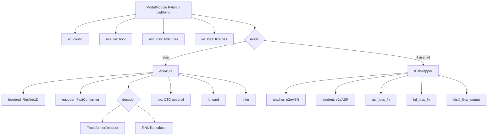

# ASR Knowledge Distillation

This project implements an Automatic Speech Recognition (ASR) system using knowledge distillation with PyTorch Lightning. The goal is to train a student model to mimic the performance of a more complex teacher model while being more efficient in terms of size and inference time.

## Project Structure

```
asr-knowledge-distillation
├── src
│   ├── data
│   │   ├── dataset.py          # Handles loading and preprocessing of audio data
│   │   └── datamodule.py       # Organizes dataset into training, validation, and test sets
│   ├── models
│   │   ├── teacher_model.py     # Implements the architecture of the teacher model
│   │   ├── student_model.py      # Implements the architecture of the student model
│   │   └── distillation.py       # Implements the knowledge distillation process
│   ├── training
│   │   ├── callbacks.py         # Defines callback functions for training
│   │   ├── trainer.py           # Manages the training loop
│   │   └── losses.py            # Defines custom loss functions
│   ├── utils
│   |   ├── metrics.py           # Utility functions for evaluation metrics
│   |   └── audio_processing.py   # Functions for audio preprocessing
|   ├── callbacks.py
|   ├── modelmodule.py
|   └── trainer.py
├── configs
│   ├── model_config.yaml        # Configuration for model architecture
│   ├── data_config.yaml         # Configuration for data loading and preprocessing
│   └── training_config.yaml     # Configuration for the training process
├── scripts
│   ├── train.py                 # Entry point for training the model
│   ├── evaluate.py              # Evaluates the trained model
│   └── infer.py                 # Makes predictions on new audio samples
├── requirements.txt             # Lists project dependencies
├── setup.py                     # Setup script for the project
└── README.md                    # Project documentation
```

## Installation

To install the required dependencies, run:

```
pip install -r requirements.txt
```

## Usage

1. **Training the Model**: To train the model, run the following command:

   ```
   python scripts/train.py
   ```

2. **Evaluating the Model**: To evaluate the trained model on a validation or test set, use:

   ```
   python scripts/evaluate.py
   ```

3. **Making Predictions**: To make predictions on new audio samples, execute:

   ```
   python scripts/infer.py
   ```

## Components

- **Data Handling**: The `src/data` directory contains scripts for loading and preprocessing audio data.
- **Model Architecture**: The `src/models` directory includes implementations of both the teacher and student models, along with the distillation process.
- **Training Loop**: The `src/training` directory manages the training process, including callbacks and custom loss functions.
- **Utilities**: The `src/utils` directory provides utility functions for metrics and audio processing.

## Main diagram


